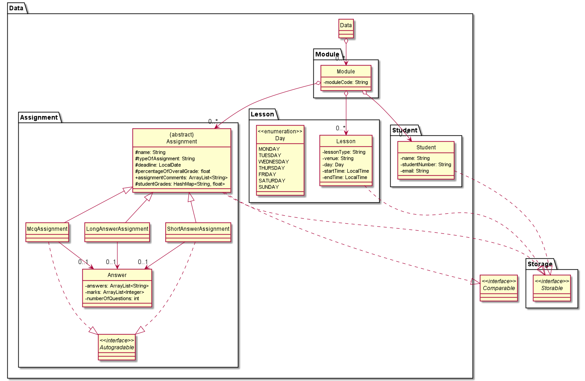

# Developer Guide

## Design 

### Architecture

The **Architecture Design** given above explains the high-level design of the App. 
Given below is a quick overview of each component.  

`Modman` is the main class of the application, and handles the app launch, 
initializing the appropriate classes to be used.  

The rest of the app consists of IDKHOWMANY components:

*
*
*

The sections below give more details of each component.

## Parser and Command Component

1. `Parser` class is used to parse the user command.
2. This returns a `Command` object which is executed in `Modman`.
3. The command execution can affect the state of 
4. The `Command` object can also instruct the `Ui` to list and display information to the user.

Given below is the Sequence Diagram for creating the corresponding `Command` object from user input via `Parser`.  
The sequence diagram also acts as a reference frame for `getCommand`.

## Assignment Component

## Data Component

The `Data`,
* stores an `ArrayList` of `Module` objects that represents the modules.
* Each `Module` object contains `ArrayLists` of `Assignment`, `Lesson`, and `Student` objects.

## Implementation

### Sorting Assignments by Deadline

### Adding Lesson to Module Timetable

## Product scope
### Target user profile

{Describe the target user profile}

### Value proposition

{Describe the value proposition: what problem does it solve?}

## User Stories

|Version| As a ... | I want to ... | So that I can ...|
|--------|----------|---------------|------------------|
|v1.0|new user|see usage instructions|refer to them when I forget how to use the application|
|v2.0|user|find a to-do item by name|locate a to-do without having to go through the entire list|

## Non-Functional Requirements

{Give non-functional requirements}

## Glossary

* *glossary item* - Definition

## Instructions for manual testing

{Give instructions on how to do a manual product testing e.g., how to load sample data to be used for testing}
