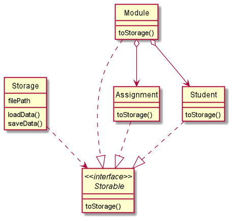
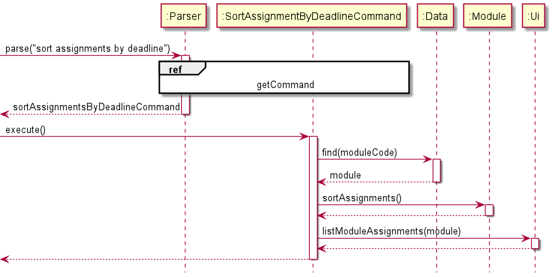

# Developer Guide

## Design

### Architecture

The **Architecture Design** given above explains the high-level design of the App.
Given below is a quick overview of each component.  

`Modman` is the main class of the application, and handles the app launch,
initializing the appropriate classes to be used.  

The rest of the app consists of four components:

* Logic
* UI
* Storage
* Data

**How the four architecture components interact with each other and the ModMan class**

The *Sequence diagram* below shows the interaction between components for when the user issues the command `add module CS2113T`

The sections below give more details of each component.

## Logic Component (Jianning)

1. The `Parser` class is used to parse the user command.
2. This returns a `Command` object which is executed in `Modman`.
3. The command execution can affect the state of other components e.g. the sort command changes the order of assignments in `Module`.
4. The `Command` object can also instruct the `Ui` to list and display information to the user.

Given below is the Sequence Diagram for creating the corresponding `Command` object from user input via `Parser`.  
The sequence diagram also acts as a reference frame for `getCommand`.

## UI Component

The UI Component consists of one class - `Ui` which provides all the functions 
required to print different kinds of messages on the console.

Given below is the Sequence Diagram for the Storage class. The storage class interacts with the database file, storing our data into the database or loading our data from the database.  
## Storage Component (Bryan)

1. The `Storage` class is used to interact with the database.txt file by calling loadData() at the start of the program and calling saveData() at the end of the program.
2. The `Storage` class will collect the data of all classes that implements the Storable interface so that these data can be saved to the database.
3. The `toStorage()` method of the Storable interface will return a string representing the object instance's data. 
4. This string will then be appended to the database.txt file.

## Data Component

The `Data`,
* stores an `ArrayList` of `Module` objects that represents the modules.
* Each `Module` object contains `ArrayLists` of `Assignment`, `Lesson`, and `Student` objects.

## Implementation

### Sorting Assignments by Deadline (Jianning)

Given below is the sequence diagram for the sort assignments by deadline command.

Given below is an example usage scenario and how the sorting mechanism behaves.

Step 1. The user launches the application. The CS2113T module has an assignment quiz1 due on 17 Aug 2021.
Step 2. The user adds 2 more assignments quiz2 and quiz3
Step 3. The user only sets the deadline for quiz3 to be 16 Aug 2021.
Step 4. The user executes `sort by deadline` which reorders the assignments in CS2113T to be quiz3, quiz1 and quiz2.
Assignments with null as deadline are sorted behind assignments with deadlines.

### [Coming Soon] Autograding (Jianning)

### Adding Lesson to Module Timetable

## Product scope
### Target user profile:
* Teaching assistants who: 
    * have a need to manage their module(s), students and assignments
    * are comfortable using CLI apps
{Describe the target user profile}

### Value proposition

Just to keep track of all informaiton pertaining to a module teaching assistants (at NUS) have to make use of multiple platforms:
* LumiNUS
* NUSMods 
* Module websites 
* Spreadsheets 

With the help of ModMan, users will be able to add, edit, and store all information on one platform, simplifying the process. In addition, features such as autograding and saving comments for assignments will free up time, allowing TAs to focus on teaching!

## User Stories

|Version| As a ... | I want to ... | So that I can ...|
|--------|----------|---------------|------------------|
|v1.0|new user|see usage instructions|refer to them when I forget how to use the application|
|v2.0|user|find a to-do item by name|locate a to-do without having to go through the entire list|

## Non-Functional Requirements

1. The application should work on any *mainstream* operating system (e.g. Windows, Linux, macOS) 
   with `Java 11` installed.
1. The application should be responsive and users should not face any sluggish performance.
1. Users who are above average in typing speed (in English) should be able to easily issue commands faster than using a mouse.

## Glossary

* *glossary item* - Definition

## Instructions for manual testing

{Give instructions on how to do a manual product testing e.g., how to load sample data to be used for testing}
