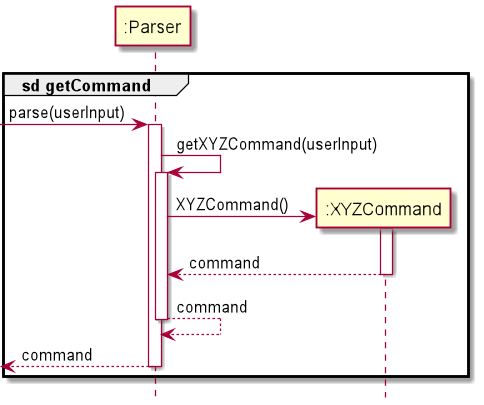
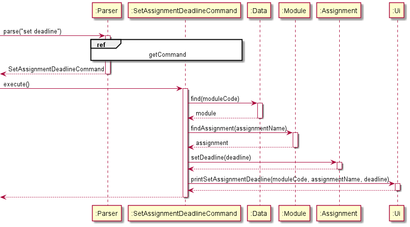
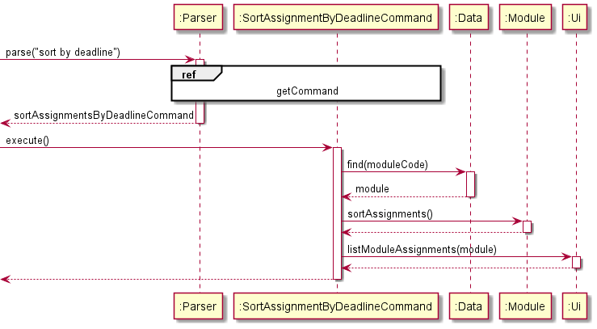

# Developer Guide

## Design

### Architecture

The **Architecture Design** given above explains the high-level design of the App.
Given below is a quick overview of each component. </br>

`Modman` is the main class of the application, and handles the app launch,
initializing the appropriate classes to be used. </br>

The rest of the app consists of four components:

* Logic
* UI
* Storage
* Data

**How the four architecture components interact with each other and the ModMan class**

The *Sequence diagram* below shows the interaction between components for when the user issues the command `add module CS2113T`


The sections below give more details of each component.


## Logic Component 


1. `Logic` uses the `Parser` class to parse the user command.
2. This creates a `Command` object which is executed in `Modman`.
3. The command execution can affect the state of the `Data` and `Storage` components. For example, the `AddModuleCommand` adds a new `Module` object in `Data`.
4. The `Command` object can also instruct the `Ui` to list and display information to the user.

Given below is the sequence diagram for creating the corresponding `Command` object from the user input via `Parser`. </br>
The sequence diagram also acts as a reference frame for `getCommand` which is common across most `Command` objects.



If a `Command` object does not use the reference frame, another sequence diagram would be used to describe how the `Command` object was created.

## UI Component
The UI Component consists of one class - `Ui` which provides all the functions
required to print different kinds of messages on te console.

1. `Ui` is class with a `Scanner` object that reads input from console.
1. `Modman` has `Ui` object as an attribute which is instantiated
   when we enter the program.
1. `Ui` object reads input from screen and returns it which will then be passed to the Parser so that it can
   parse the command.
1. Depending on the parsed command, the corresponding
   `execute()` function of the  `Command` abstract class
   runs. It accepts `Ui` object as a parameter and calls the relevant `Ui` methods
   that prints the messages.
   <br>
   <br>

Given below is the Sequence Diagram for the Storage class. The storage class interacts with the database file, storing our data into the database or loading our data from the database. </br>
## Storage Component (Bryan)


1. The `Storage` class is used to interact with the database.txt file by calling loadData() at the start of the program and calling saveData() at the end of the program.
2. The `Storage` class will collect the data of all classes that implements the Storable interface so that these data can be saved to the database.
3. The `toStorage()` method of the Storable interface will return a string representing the object instance's data. 
4. This string will then be appended to the database.txt file.

## Data Component
The figure below shows the classes in ModMan that tracks module information data.


The `Data`,
1. Stores `Module` objects that represents the modules.
2. Each `Module` contains the details of `Lesson` and `Student` objects which implements the `Storable` interface, as well as abstract `Assignment` objects which implement the `Storable` and `Comparable` interfaces.

## Implementation

### Editing Assignment Information (Jianning and Bryan)

This section provides details on the implementation of the various commands that modify the `Assignment` object.

There are 4 attributes of the `Assignment` object in which the User can interact with:

1. Deadline - `LocalDate` representing the date which the assignment should be graded by.
2. Percentage - `float` of the percentage of the overall grade which the assignment carries in the module.
3. Students' Grades - `HashMap<String, Float>` of the students' grades for the assignment, where the key is the Student/Matric Number and the value is the Grade out of 100%.
4. Comments - `String` representing comments for particular questions and/or the overall assignment.

### `SetAssignmentDeadlineCommand`

The `SetAssignmentDeadlineCommand` is used to set or update the deadline which the `Assignment` has to be graded by. 
The deadline can then be used to sort the assignments based on the urgency of the grading.

Given below is the sequence diagram for the `SetAssignmentDeadlineCommand`:



| :information_source: |  deadline passed into the setDeadline() function is of type `LocalDate` |
|----------------------|-------------------------------------|

Implementation considerations for using `LocalDate` for deadline attribute in `Assignment`:

* `LocalDate` is an immutable class that represents dates with a default format of yyyy-MM-dd
* `LocalDate` allows for standardisation of the format and representation of deadlines
* `LocalDate` has a built-in compareTo() method that allows us to compare and order two dates
* `LocalDate` allows us to easily sort `Assignment` objects by their deadline attribute

### `SetAssignmentGradeCommand`

The `SetAssignmentGradeCommand` is used to 

Given below is the sequence diagram for the `SetAssignmentGradeCommand`:

Implementation considerations for using `HashMap<String, Float>` to store students'grades:


### Sorting Assignments by Deadline (Jianning)

The `SortAssignmentByDeadlineCommand` is used to reorder the ArrayList of `Assignment` objects stored in the current `Module`. </br>

The `Assignment` objects will be sorted based on their deadline attribute, which is of type `LocalDate`. 
The deadline of an `Assignment` object can be `null`, in which case the `Assignment` will be sorted after other `Assignment` objects with valid `LocalDate` deadlines.
The sorting is also stable, and will retain the initial order of when the `Assignment` was added to the `Module`. </br> 

The code snippet for the compareTo() function which allows `Assignment` to implement the `Comparable` interface is as follows:

````
    @Override
    public int compareTo(Assignment other) {
        if (this.getDeadline() == null && other.getDeadline() == null) {
            return 0;
        } else if (this.getDeadline() == null) {
            return 1;
        } else if (other.getDeadline() == null) {
            return -1;
        }
        return this.getDeadline().compareTo(other.getDeadline());
    }
````
| :information_source: | Modifying the compareTo() function allows you to easily change the natural ordering of the objects of the `Assignment` Class. </br> Other attributes can also be added to `Assignment`objects in the future to be used for comparing. |
|----------------------|-------------------------------------|


Given below is the sequence diagram for the `SortAssignmentsByDeadlineCommand`:




### Autograding Assignments (Jianning)

The `AutogradeAssignmentCommand` is used to grade all current students' scripts found in the `scripts` directory. </br>
The grades for each student will also be automatically saved and updated in the `Assignment`.</br>
Autograding also keeps track of which students in the current student list have not submitted their assignment. </br>

| :information_source: |  Currently, only the `McqAssignment` and `ShortAnswerAssignment` implement the `Autogradable`interface|
|----------------------|-------------------------------------|

The sequence in which Autograding is carried out is as follows:

1. The relevant `Module` is retrieved from `Data`, followed by the `Assignment` we wish to autograde and the current students in that `Module`.
2. The `Answer` for the `Assignment` is read from the corresponding text file in the `answers` directory and is set or updated in the `Assignment`.
3. If the `Assignment` is of type `McqAssignment` or `ShortAnswerAssignment`, their respective `autogradeAssignment` method will be invoked. Else, the `NotAutogradableException()` will be thrown.
4. Within the `autogradeAssignment` method, for each `Student` in the student list:</br>
   4.1. If the script for the `Student` can be found in the `scripts` directory, the script is loaded and compared with the `Answer`. The grade for the `Student` is calculated and saved in the `HashMap<String, Float>` of students' grades in `Assignment`.</br>
   4.2.  Else, grading for the `Student` is skipped and the loop continues.
5. Based on the `HashMap<String, Float>` of students' grades, if a `Student`'s grade is `null` for the `Assignment`, they are added to the ungraded list.
6. The students' grades as well as the list of students who have not submitted their work are displayed through `Ui`.

The aforementioned sequence of events is also shown in the following sequence diagrams:


:information_source: Reference frames for the `AutogradeAssignmentCommand` sequence diagram:
* The `getCommand` reference frame can be found in the `Logic Component` section.
* The `loadAnswer` and `loadScript` reference frames can be found in the `Storage Component` section.
* Since the `autogradeMcq` and `autogradeShortAnswer` reference frames are similar, only `autogradeMcq` will be shown below. More details about the difference between autograding for Mcq and Short Answer will be discussed below as well.


Reference frame for `autogradeMcq`:


Implementation Considerations in Autograding:

`Updating of Answer Key` </br>

* The answer key is updated in the `Assignment` every time an `Answer` is read from the text file in the `answers` directory, even if there was an existing `Answer` saved. </br>
* This is to account for any changes in the answer key due to changes in grading or more options being accepted. </br>
* By the same principle, all the students' scripts would be graded again as well, even if they had been graded previously. </br>
* The grades for each `Student` will also be updated in the `HashMap` accordingly.

`Mcq vs Short Answer` </br>

* The answer key for `McqAssignment`s is limited to the options A through E and 1 to 5 while the answer key for `ShortAnswerAssignment`s has no restrictions.
* Alternative implementations of using Enumerations for Mcq options were considered. 
  However, as the students scripts were not stored in the `Assignment`, it was redundant to convert the answers read from the `answers` directory to an enum 
  just to convert it back to a String to be compared with the student's script.
* Checking for valid Mcq options are still done when setting or updating the `Answer` before autograding. If there is an invalid option, the `InvalidMcqOption` exception will be thrown.

`Autogradable Interface` </br>

* Currently, only `McqAssignment` and `ShortAnswerAssignment` implement the `Autogradable` Interface.
* This is to restrict autograding for assignments with fixed answers and no partial grading.

The Class Diagram for `Assignment` given below shows all the types of assignments that inherit from `Assignment` and the ones which implement the `Autogradable` Interface:


### [Coming soon] Get statistics from Autograde

Autograding assignments also generates statistics on how students performed for each question in the assignment.


### Adding Lesson to Module Timetable


## Product scope
### Target user profile:
* Teaching assistants who: 
    * have a need to manage their module(s), students and module assignments
    * are comfortable using CLI apps
{Describe the target user profile}

### Value proposition

To keep track of all information pertaining to a module, teaching assistants (at NUS) have to make use of multiple platforms:
* LumiNUS
* NUSMods 
* Module websites 
* Spreadsheets 

With the help of ModMan, users will be able to add, edit, and store all information on one platform, simplifying the process. In addition, features such as autograding and saving comments for assignments will free up time, allowing TAs to focus on teaching!


## User Stories

|Version| As a ... | I want to ... | So that I can ...|
|--------|----------|---------------|------------------|
|v1.0|Teaching Assistant|add modules that I am teaching|keep track of the information for each of my modules|
|v1.0|Teaching Assistant|add the time and day of a module's lesson|keep track of my teaching timetable|
|v1.0|Teaching Assistant|add my student's details|contact them if they need help|
|v2.0|Teaching Assistant|view my students' weekly grades for their assignments|focus on the students who are not doing well|
|v2.0|Teaching Assistant|edit a module's lesson information|keep track of changes in lesson schedule|
|v2.0|Teaching Assistant|print out assignments due within a certain time frame|keep track of the more urgent assignments|

## Non-Functional Requirements

1. The application should work on any *mainstream* operating system (e.g. Windows, Linux, macOS) 
   with `Java 11` installed.
1. The application should be responsive - users should not face any sluggish performance.
1. Users who have above average typing speeds (in English) should be able to easily issue commands faster than using a mouse.


## Glossary

* *glossary item* - Definition

## Instructions for manual testing

{Give instructions on how to do a manual product testing e.g., how to load sample data to be used for testing}
