# Developer Guide

## Introduction

````
 __  __           _   __  __ 
|  \/  |         | | |  \/  |
| \  / | ___   __| | | \  / | __ _ _ __
| |\/| |/ _ \ / _  | | |\/| |/ _  |  _ \
| |  | | (_) | (_| | | |  | | (_| | | | |
|_|  |_|\___/ \__'_| |_|  |_|\__'_|_| |_|
````

ModMan, short for Module Manager, is a desktop app designed to help Teaching Assistants (TAs) manage their module(s). 
It is optimized for use via a Command Line Interface (CLI). 
ModMan helps to track module details as well as students’ progress and data, 
all in one platform. It can also perform autograding for MCQ assignments.

### About this Developer Guide

This developer guide details how ModMan is designed, implemented and tested. 
Readers can find out more about the overall architecture of ModMan, and also the implementation 
behind various functionalities. Technically inclined readers may wish to use the developer guide and
further implement features or customise ModMan for their own use!

### How to use the Developer Guide

The Developer Guide has been split into clear sections to allow readers to quickly navigate to their desired 
information.

* You may navigate to any section from the [Table of contents](#table-of-contents).
* Click [here](#setting-up) for the Setting Up section and get started as a developer!
* Alternatively, if you wish to dive right into ModMan's implementation, 
  we would recommend starting in the [Design](#design) section.

## Table of contents
* [Setting Up](#setting-up)
* [Design](#design)
    * [Architecture](#architecture)
    * [Logic](#logic-component)
    * [UI](#ui-component)
    * [Storage](#storage-component)
    * [Data](#data-component)
* [Implementation](#implementation)
    * [Editing Assignment Information](#editing-assignment-information-jianning-and-bryan)
    * [Sorting Assignments by Deadline](#sorting-assignments-by-deadline-jianning)
    * [Autograding Assignments](#autograding-assignments-jianning)
    * [(Coming soon) Get statistics from Autograde](#coming-soon-get-statistics-from-autograde)
    * [Adding Lesson to Module Timetable](#adding-lesson-to-module-timetable)
* [Product scope](#product-scope)
    * [Target user profile](#target-user-profile)
    * [Value proposition](#value-proposition)
    * [User stories](#user-stories)
    * [Non-functional requirements](#non-functional-requirements)
* [Glossary](#glossary)
* [Instructions for manual testing](#instructions-for-manual-testing)
    
## Setting Up

You may follow this Setting Up guide and get started as a developer! This guide helps you import ModMan onto IntelliJ IDEA,
but feel free to use your preferred IDE. 

1. Ensure you have Java 11 installed on your computer or install it from [here](https://www.oracle.com/sg/java/technologies/javase-jdk11-downloads.html).
1. Fork the ModMan repository from [here](https://github.com/AY2021S2-CS2113T-F08-1/tp).
1. Clone your fork to your local machine, using the Git software you prefer.
1. Open IntelliJ IDEA; you may download it from [here](https://www.jetbrains.com/idea/) first.
1. Import the cloned repository as a Gradle project.
1. To ensure everything is working correctly, you may right click the `ModMan.java` file and select `Run Modman.main()`. You can also test some of ModMan's commands.

For readers who are not familiar with the commands of ModMan, they can access the User Guide [here](https://ay2021s2-cs2113t-f08-1.github.io/tp/UserGuide.html).

## Design

This section describes the four architecture components of ModMan, as well as the connections between them.
The overall architecture of ModMan is explained first, before diving into each of the architecture components.

### Architecture

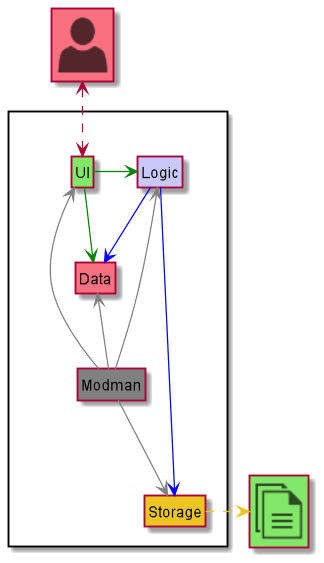

The **Architecture Design** given above explains the high-level design of ModMan.
Given below is a quick overview of each component. </br>

`Modman` is the main class of the application, and handles the app launch,
initializing the appropriate classes to be used. </br>

The rest of the app consists of four components:

* Logic
* UI
* Storage
* Data

**How the four architecture components interact with each other and the ModMan class**

The *Sequence diagram* below shows the interaction between components for when the user issues the command `add module CS2113T`

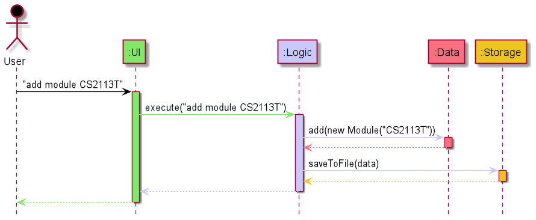

The sections below give more details of each component.


### Logic Component 

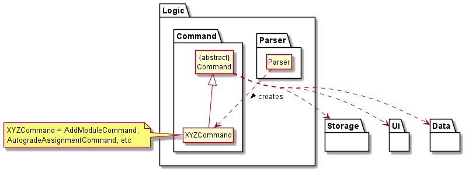

1. `Logic` uses the `Parser` class to parse the user command.
2. This creates a `Command` object which is executed in `Modman`.
3. The command execution can affect the state of the `Data` and `Storage` components. For example, the `AddModuleCommand` adds a new `Module` object in `Data`.
4. The `Command` object can also instruct the `Ui` to list and display information to the user.

Given below is the sequence diagram for creating the corresponding `Command` object from the user input via `Parser`. </br>
The sequence diagram also acts as a reference frame for `getCommand` which is common across most `Command` objects.


If a `Command` object does not use the reference frame, another sequence diagram would be used to describe how the `Command` object was created.

## UI Component

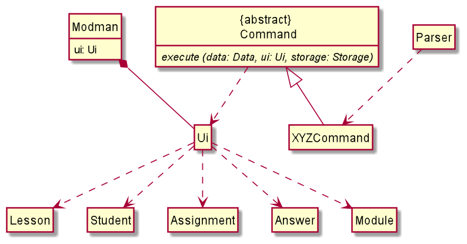

The UI Component consists of one class - `Ui` which provides all the functions
required to print different kinds of messages on the console.

1. `Ui` is class with a `Scanner` object that reads input from console.
1. `Modman` has `Ui` object as an attribute which is instantiated
   when we enter the program.
1. `Ui` object reads input from screen and returns it which will then be passed to the `Parser` so that it can
   parse the command.
1. `Command` is an abstract class that has multiple derived command classes that implement
   the abstract method `execute`.
1. Depending on the parsed user input, a command class object is created and the corresponding
   `execute()` method runs. It accepts `Ui` object as a parameter and calls the relevant `Ui` methods
   that prints the specific messages.
1. Each `Ui` method has different parameters such as `Lesson`, `Student`, `Assignment`, `Answer`, `Module` objects
   which form dependencies between `Ui` and these classes.

### Storage Component

<br>For the Storage functionality of the application, I have added a new `Storable` interface that is implemented by the three main entities of the app: Assignment, Student and Lesson.</br> The `Storable` interface mandates the user to write a `toStorage()` method in order to be stored in the database. The `toStorage()` method converts all information of an object into a `String` format to be appended onto the database.

The implementation of the `Storable` interface helps to decouple the Storage class from all classes that require storing of their instances into the database. This is because by implementing `Storable`, all `Storage` class needs to do to store an object information into the database would be to interact with the `Storable` interface via the `toStorage()` method. 

<br>Given below is the Class Diagram for the Storage class. The storage class interacts with the Database file, ensuring that user's data will be saved at the end of each session and loaded up upon the user's next visit. </br>


The `Storage` class is used to interact with the database.txt file. The `loadData()` function of the Storage object will be called at the start of the program and `saveData()` at the end of the program.


`loadData()`: 

The `loadData()` method is illustrated in the sequence diagram below.

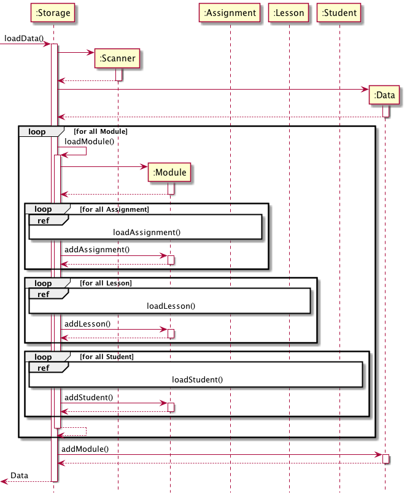

As can be seen, multiple loops are required to load all the information of each object instance from the Database so that the user's data can be retrieved fully.

`saveData()`:

When the `saveData()` method is called, the `toStorage()` method of each object instance implementing the `Storable` interface will be called. The return string of each `toStorage()` method will then be appended onto the database.
 
`loadAnswer()`:

For Autograding purpose, the `Storage` class is required to retrieve the answers and students' scripts from the respective .txt files that they were stored in. The `loadAnswer()` method in the `Storage` class fulfils this. The Sequence Diagram below exhibits the behaviour of the `loadAnswer()` method.

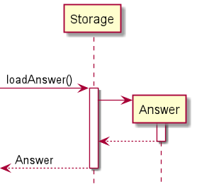

`loadScript()`:

Similarly to `loadAnswer()` as shown in the above Sequence Diagram, the `loadScript()` method follows the same logic in retrieving each student's script from their input file, scanning them as Data and allowing us to perform Autograding.

#### Database Failure:

The database should not be tampered with by the user. If the user opens up `Database.txt` and edits its contents, the data will likely be corrupted. In such cases, the program will fail upon starting, prompting the user to delete `Database.txt` before running the program again. 

### Data Component
The figure below shows the classes in ModMan that tracks module information data.


The `Data`,
1. Stores `Module` objects that represents the modules.
2. Each `Module` contains the details of `Lesson` and `Student` objects which implements the `Storable` interface, as well as abstract `Assignment` objects which implement the `Storable` and `Comparable` interfaces.

## Implementation

### Editing Assignment Information

This subsection provides details on the implementation of the various commands that modify the `Assignment` object.

There are 4 attributes of the `Assignment` object in which the User can interact with:

1. Deadline - `LocalDate` representing the date which the assignment should be graded by.
2. Percentage - `float` of the percentage of the overall grade which the assignment carries in the module.
3. Students' Grades - `HashMap<String, Float>` of the students' grades for the assignment, where the key is the Student/Matric Number and the value is the Grade out of 100%.
4. Comments - `String` representing comments for particular questions and/or the overall assignment.

### `SetAssignmentDeadlineCommand`

The `SetAssignmentDeadlineCommand` is used to set or update the deadline which the `Assignment` has to be graded by. 
The deadline can then be used to sort the assignments based on the urgency of the grading.

Given below is the sequence diagram for the `SetAssignmentDeadlineCommand`:

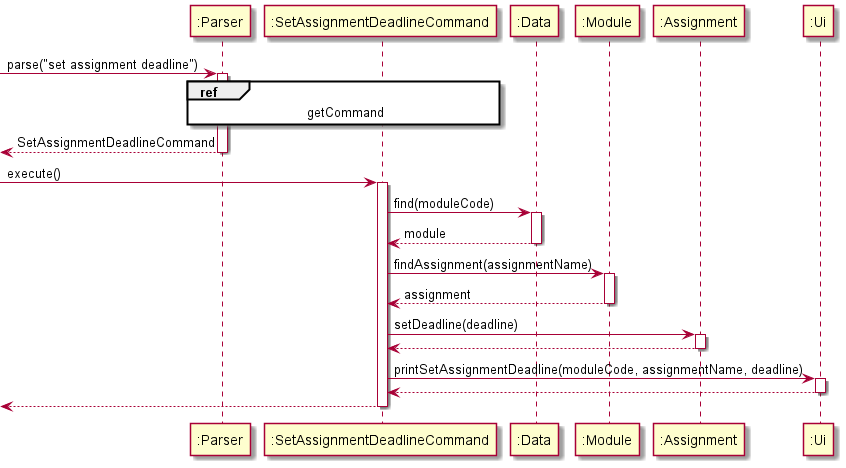

| :information_source: |  deadline passed into the setDeadline() function is of type `LocalDate` |
|----------------------|-------------------------------------|

Implementation considerations for using `LocalDate` for deadline attribute in `Assignment`:

* `LocalDate` is an immutable class that represents dates with a default format of yyyy-MM-dd
* `LocalDate` allows for standardisation of the format and representation of deadlines
* `LocalDate` has a built-in compareTo() method that allows us to compare and order two dates
* `LocalDate` allows us to easily sort `Assignment` objects by their deadline attribute

### `SetAssignmentGradeCommand`

The `SetAssignmentGradeCommand` is used to set or update the grade of the `Assignment` for a `Student`. This can be used to track individual grades for each student.

Given below is the sequence diagram for the `SetAssignmentGradeCommand`:

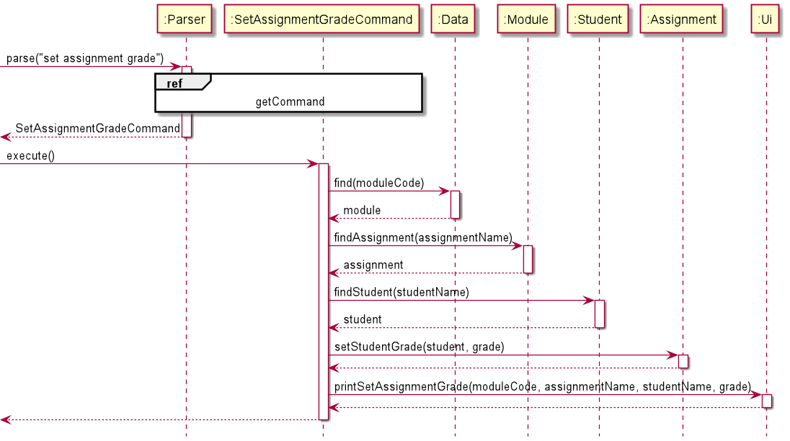

Implementation considerations for using `HashMap<String, Float>` to store students' grades:

* `HashMap` allows for easy storage of "key/value" pairs, with the `studentName` and `grade` corresponding to key and value respectively
* `HashMap` has worst case get/put complexity of `O(logn)`, which offers decent time complexity performance when setting and retrieving the `grade`
    * `HashMap` may have even better performance with a good hash
    

### Sorting Assignments by Deadline

The `SortAssignmentByDeadlineCommand` is used to reorder the ArrayList of `Assignment` objects stored in the current `Module`. </br>

The `Assignment` objects will be sorted based on their deadline attribute, which is of type `LocalDate`. 
The deadline of an `Assignment` object can be `null`, in which case the `Assignment` will be sorted after other `Assignment` objects with valid `LocalDate` deadlines.
The sorting is also stable, and will retain the initial order of when the `Assignment` was added to the `Module`. </br> 

The code snippet for the compareTo() function which allows `Assignment` to implement the `Comparable` interface is as follows:

````
    @Override
    public int compareTo(Assignment other) {
        if (this.getDeadline() == null && other.getDeadline() == null) {
            return 0;
        } else if (this.getDeadline() == null) {
            return 1;
        } else if (other.getDeadline() == null) {
            return -1;
        }
        return this.getDeadline().compareTo(other.getDeadline());
    }
````
| :information_source: | Modifying the compareTo() function allows you to easily change the natural ordering of the objects of the `Assignment` Class. </br> Other attributes can also be added to `Assignment`objects in the future to be used for comparing. |
|----------------------|-------------------------------------|


Given below is the sequence diagram for the `SortAssignmentsByDeadlineCommand`:

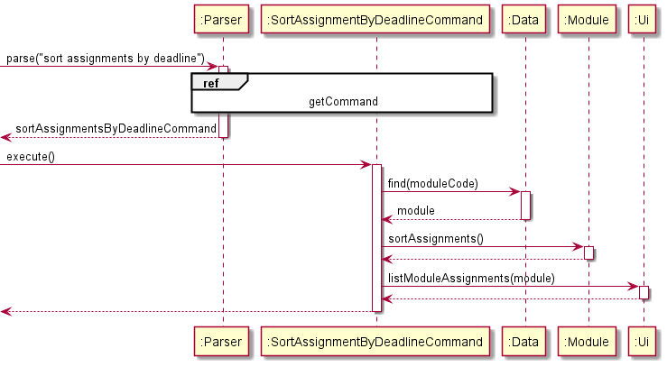


### Autograding Assignments

The `AutogradeAssignmentCommand` is used to grade all current students' scripts found in the `scripts` directory. </br>
The grades for each student will also be automatically saved and updated in the `Assignment`.</br>
Autograding also keeps track of which students in the current student list have not submitted their assignment. </br>

| :information_source: |  Currently, only the `McqAssignment` and `ShortAnswerAssignment` implement the `Autogradable`interface|
|----------------------|-------------------------------------|

The sequence in which Autograding is carried out is as follows:

1. The relevant `Module` is retrieved from `Data`, followed by the `Assignment` we wish to autograde and the current students in that `Module`.
2. The `Answer` for the `Assignment` is read from the corresponding text file in the `answers` directory and is set or updated in the `Assignment`.
3. If the `Assignment` is of type `McqAssignment` or `ShortAnswerAssignment`, their respective `autogradeAssignment` method will be invoked. Else, the `NotAutogradableException()` will be thrown.
4. Within the `autogradeAssignment` method, for each `Student` in the student list:</br>
   4.1. If the script for the `Student` can be found in the `scripts` directory, the script is loaded and compared with the `Answer`. The grade for the `Student` is calculated and saved in the `HashMap<String, Float>` of students' grades in `Assignment`.</br>
   4.2.  Else, grading for the `Student` is skipped and the loop continues.
5. Based on the `HashMap<String, Float>` of students' grades, if a `Student`'s grade is `null` for the `Assignment`, they are added to the ungraded list.
6. The students' grades as well as the list of students who have not submitted their work are displayed through `Ui`.

The aforementioned sequence of events is also shown in the following sequence diagrams:

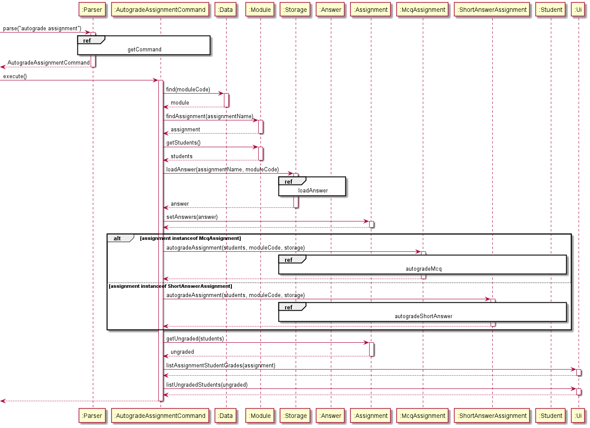

:information_source: Reference frames for the `AutogradeAssignmentCommand` sequence diagram:
* The `getCommand` reference frame can be found in the `Logic Component` section.
* The `loadAnswer` and `loadScript` reference frames can be found in the `Storage Component` section.
* Since the `autogradeMcq` and `autogradeShortAnswer` reference frames are similar, only `autogradeMcq` will be shown below. More details about the difference between autograding for Mcq and Short Answer will be discussed below as well.


Reference frame for `autogradeMcq`:

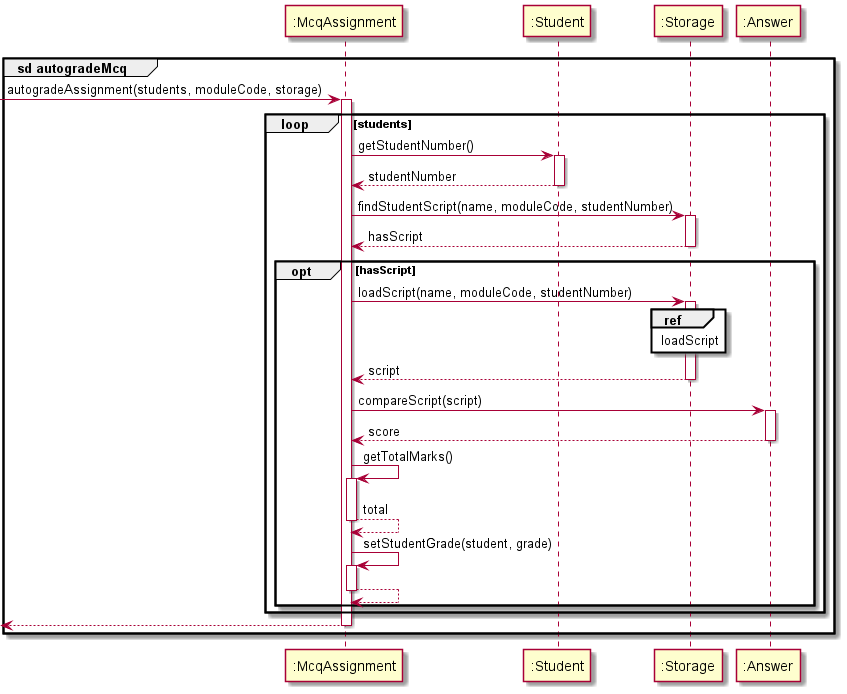

Implementation Considerations in Autograding:

`Updating of Answer Key` </br>

* The answer key is updated in the `Assignment` every time an `Answer` is read from the text file in the `answers` directory, even if there was an existing `Answer` saved. </br>
* This is to account for any changes in the answer key due to changes in grading or more options being accepted. </br>
* By the same principle, all the students' scripts would be graded again as well, even if they had been graded previously. </br>
* The grades for each `Student` will also be updated in the `HashMap` accordingly.

`Mcq vs Short Answer` </br>

* The answer key for `McqAssignment`s is limited to the options A through E and 1 to 5 while the answer key for `ShortAnswerAssignment`s has no restrictions.
* Alternative implementations of using Enumerations for Mcq options were considered. 
  However, as the students scripts were not stored in the `Assignment`, it was redundant to convert the answers read from the `answers` directory to an enum 
  just to convert it back to a String to be compared with the student's script.
* Checking for valid Mcq options are still done when setting or updating the `Answer` before autograding. If there is an invalid option, the `InvalidMcqOption` exception will be thrown.

`Autogradable Interface` </br>

* Currently, only `McqAssignment` and `ShortAnswerAssignment` implement the `Autogradable` Interface.
* This is to restrict autograding for assignments with fixed answers and no partial grading.

The Class Diagram for `Assignment` given below shows all the types of assignments that inherit from `Assignment` and the ones which implement the `Autogradable` Interface:

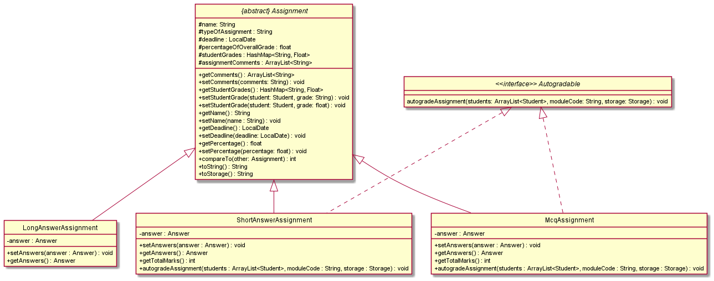

### [Coming soon] Get statistics from Autograde

Autograding assignments also generates statistics on how students performed for each question in the assignment.


### Adding Lesson to Module Timetable
The `AddTimetableCommand` is used to add a `Lesson` to the timetable for the `Module` selected.

Given below is the sequence diagram for the `AddTimetableCommand`:
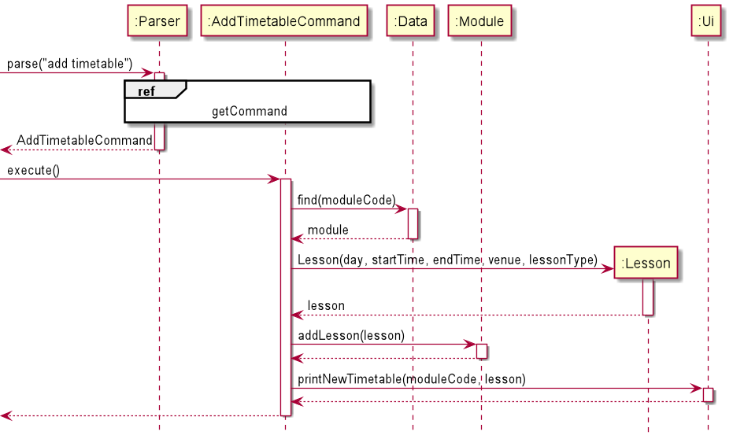

| :information_source: |  - `startTime` and `endTime` passed into the `Lesson` constructor is of type `LocalTime`<br> - `day` is of enumeration type `Day`|
|----------------------|-------------------------------------|


## Product scope

Product scope provides you an insight into the value of ModMan, and its benefits for target users.

### Target user profile:
* Teaching assistants who: 
    * have a need to manage their module(s), students, lessons and module assignments
    * are comfortable using CLI apps

### Value proposition

To keep track of all information pertaining to a module, teaching assistants (at NUS) have to make use of multiple platforms:
* LumiNUS
* NUSMods 
* Module websites 
* Spreadsheets 

With the help of ModMan, users will be able to add, edit, and store all information on one platform, simplifying the process. In addition, features such as autograding and saving comments for assignments will free up time, allowing TAs to focus on teaching!

### User Stories

|Version| As a ... | I want to ... | So that I can ...|
|--------|----------|---------------|------------------|
|v1.0|Teaching Assistant|add modules that I am teaching|keep track of the information for each of my modules|
|v1.0|Teaching Assistant|add the time and day of a module's lesson|keep track of my teaching timetable|
|v1.0|Teaching Assistant|add my student's details|contact them if they need help|
|v1.0|Teaching Assistant|add upcoming module assignments|manage and plan out my schedule easily|
|v2.0|Teaching Assistant|view my students' grades for each assignment|focus on the students who are not doing well|
|v2.0|Teaching Assistant|edit a module's lesson information|keep track of changes in lesson schedule|
|v2.0|Teaching Assistant|sort out assignments by deadline|keep track of the more urgent assignments|
|v2.0|Teaching Assistant|obtain an overview of information related to a module|easily view my teaching timetable, upcoming assignments and students|
|v2.0|Teaching Assistant|auto-grade assignments|save time while marking and focus, instead, on teaching!|
|v2.0|Teaching Assistant|add comments to assignments|refer back to them when other students make the same mistake|


### Non-Functional Requirements

1. The application should work on any *mainstream* operating system (e.g. Windows, Linux, macOS) 
   with `Java 11` installed.
1. The application should be responsive - users should not face any sluggish performance.
1. Users who have above average typing speeds (in English) should be able to easily issue commands faster than using a mouse.
1. The application should not depend on any remote servers. This means it can be accessed anywhere, without a need for an Internet connection. 


## Glossary

* *Module* - Structured unit of study or academic programme that TAs may be involved in.
* *Assignment* - Work assigned to students that TAs are in charge of tracking, grading or commenting on.
* *Autograde* - Automatic grading of student assignment scripts against a set answer.
* *IDE* - Integrated development environment, software applications for software development

## Instructions for manual testing

### Initial launch

### Sorting Assignments

Ensure you have added a few assignments to be sorted.

Test Case 1: Assignments with different deadlines</br>
Expected: Assignments will be sorted with the more urgent deadlines near the top of the list.

Test Case 2: Assignments with the same deadline</br>
Expected: Sorting assignments is stable. Assignments with the same deadline will retain the initial order of when they were added to the module.

Test Case 3: Assignments with no deadline</br>
Expected: Assignments with no deadline will be sorted after other assignments with valid deadlines. Two assignments both without deadlines will also retain their initial order.


### Autograding Assignments

Here are some steps you can take to begin testing the autograde feature:

1. Add your students and assignments to the module.
2. Add the answer key and student scripts to the respective folders.
3. Check if you can load the answer key and student script from ModMan. If it does not load:</br>
    3.1 Check if you have added the assignment or student.</br>
    3.2 Check if you have named the text files according to the format shown in the User Guide section 2.23
   
Test Case 1: Answer key question numbers are not in sequential order.</br>
Expected: Error message regarding misalignment of question numbers shown.

Test Case 2: Answer key contains non integer question numbers.</br>
Expected: Error message regarding invalid question number shown

Test Case 3: Number of questions in answer key and script are different.</br>
Expected: Error message regarding misalignment of question numbers shown.

Test Case 4: MCQ assignment has invalid MCQ option.</br>
Expected: Error message regarding invalid MCQ option shown.

For more test cases, refer to User Guide section 2.23, 2.25 and 2.26